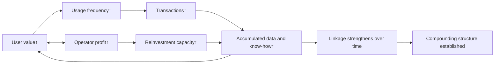

[Japanese version is here](/posts/ja-20260921-platform-business-failure-structure/)

# The Structural Failure Patterns of Platform Businesses

I want to think about what is required for a platform to work as a business.  
It is hard to define a platform business strictly, but if I force a definition, it is a business structure where the more users trade or gain utility on the platform, the more the platform operator's profit also grows.  
In this article, I will look at the reverse case: how businesses fail when this structure does not hold.

## 1. User activity grows, but profit does not follow

The first failure pattern is that growth in user activity does not align with growth in operator profit.  
Even when user count or GMV increases, the structure quickly breaks if customer acquisition cost keeps rising, or if per-transaction cost does not match user ROI.

It looks like growth from the outside, but internally it gets harder as it scales.  
At that point, the model is closer to a labor-intensive service business than a platform.  
Unless this linkage works, scale becomes a burden instead of an advantage.

## 2. The product does not become compound

The next failure pattern is that product value does not accumulate.  
A platform should become stronger with usage: data, transaction history, reputation, and operational know-how should build up and improve future transactions.

In failed cases, each transaction is served almost from zero.  
That is simple interest, not compounding, and it lacks repeatability.

- More transactions, but no better matching quality  
- More usage, but no reduction in operating load  
- More data, but no better decisions

The true growth driver is a loop: users explore the platform more, usage frequency rises, that activity creates more transactions, and those transactions attract even more new users.  
When compounding is absent, this loop never fully starts, and growth depends on external input such as paid ads, discounts, and sales headcount.  
As a result, growth tends to stay linear with input, and discontinuous expansion rarely happens.

## 3. Shallow domain understanding blocks core use cases

Why does #2 happen? One major reason is shallow domain understanding.  
Many teams rush into horizontal expansion and end up with features that are broad but do not deeply solve any core use case.

The essence of a platform is not just creating a marketplace.  
It is converting tacit knowledge in field decisions and operations into reusable assets (structured workflows and software).

- What factors are truly needed for decisions in the field?  
- What are the real workflows, including both normal and exception paths?  
- What regulations, business customs, and operational constraints exist?

Without this depth, feature count may grow, but core use-case adoption will not.

## 4. Most obvious problems are already being solved

Another key point is that the nature of remaining problems has changed.  
Areas like accounting, CRM, and ecommerce carts — where problems are clear and ROI is easy to explain — already have many solutions.

What remains is often the opposite:

- Hard-to-define, hard-to-standardize problems  
- Domestic or niche fields that are hard to access  
- Operations that require real-world touchpoints  
- Themes historically avoided because ROI was hard to prove

These areas are difficult, but that difficulty itself creates barriers to entry, and solving them can generate large value.

## The key question is not growth rate, but structural validity

In platform businesses, the first thing to check is not the growth rate.  
It is whether user value growth and operator profit growth are truly linked.  
And whether that linkage strengthens over time as a compounding structure.

Failed businesses lose that linkage.  
Successful ones design for it.

In other words, the core of platform strategy is not just "building a place."  
It is **designing a structure where value and profit compound together**.

