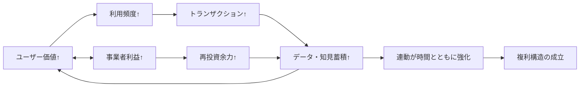

# プラットフォーム事業の失敗の構造

プラットフォームを事業として成立させるために、何が必要なのかを考えてみたい。  
プラットフォーム事業を厳密に定義するのは難しいが、あえて言えば、ユーザーがその上で商いをしたり便益を享受したりするほど、プラットフォーム事業者の利益も増える――そんな構造を持つ事業だと捉えられる。  
本稿では逆に、この構造を満たせない事業がどのように失敗していくのかを整理したい。

## 1. ユーザーの活動が増えても、利益が連動しない

最初の失敗は、ユーザー活動の拡大と事業者利益の拡大が連動していないことだ。  
ユーザー数や流通総額（GMV）が伸びていても、新規ユーザーの獲得コストが上がり続けたり、1トランザクションあたりのコストとユーザーROIが噛み合わなかったりすれば、構造はすぐに歪む。

見た目は伸びているのに、実態は「増えるほど苦しい」。  
この状態は、プラットフォームというより労働集約的な受託モデルに近い。  
連動が成立しない限り、規模は武器ではなく重荷になる。

## 2. プロダクトが「複利」にならない

次の失敗は、プロダクト価値が積み上がらないことだ。  
本来、プラットフォームは利用が進むほど、データ・取引履歴・評価・オペレーション知見が蓄積し、次の取引をより良くする「複利構造」を持つべきである。

しかし失敗する事業では、毎回ほぼゼロから価値提供してしまう。  
つまり単利であり、再現性がない。

- 取引が増えてもマッチング精度が上がらない
- 利用が増えても運営工数が減らない
- データが溜まっても意思決定が改善されない

本来の成長ドライバーは、ユーザーがプラットフォーム内を回遊し、利用頻度が上がり、その活動がさらにトランザクションを生み、新規ユーザーの流入まで促す循環にある。  
しかし複利構造が成立していないと、この循環は立ち上がらず、成長は「広告費」「値引き」「営業人数」といった外部投入に依存する。  
その結果、投入量に比例する線形成長を超えにくく、非連続な拡大は起きない。

## 3. ドメイン知識を深掘りできず、コアユースケースを取れない

では、なぜ2が起きるのか。大きな要因のひとつは、ドメイン理解の浅さだ。  
多くの開発は「まず横展開」を急ぎ、結果としてどのユースケースにも深く刺さらなくなる。

プラットフォームの本質は、単に場を作ることではない。  
現場の意思決定やオペレーションに埋め込まれた暗黙知を資産化（構造化・ソフトウェア化）し、再利用可能な仕組みに変えることにある。

- 現場の意思決定に必要な要素は何か
- 正常処理・例外処理を含めたワークフローはどうなっているか
- 規制・商習慣・現場制約は何か

ここを押さえないままでは、便利機能は増えても、コアなユースケースは獲得できない。

## 4. 「分かりやすい課題」はすでに解かれつつある

さらに重要なのは、解くべき課題の難易度そのものが変わっていることだ。  
会計処理、CRM、ECカートのような「課題が明確でROIが説明しやすい領域」には、すでに多くの解が存在する。

これから残るのは、むしろ逆の領域である。

- 分かりにくく、標準化しにくい課題
- ドメスティックでアクセスが難しい現場
- リアル接点が不可欠な業務
- これまでROIが出しづらく、後回しにされてきたテーマ

難しいがゆえに参入障壁があり、解ければ価値が大きい。

## 問うべきは「成長速度」より「構造の成立」

プラットフォーム事業で最初に確認すべきは、成長率ではない。  
ユーザー価値の増加と事業者利益の増加が、本当に連動しているか。  
そして、その連動が時間とともに強まる複利構造になっているか。

失敗する事業は、ここが切れている。  
成功する事業は、ここを設計している。

つまり、プラットフォーム戦略の本質は「場を作ること」ではなく、  
**価値と利益が同時に積み上がる構造を作ること**にある。

